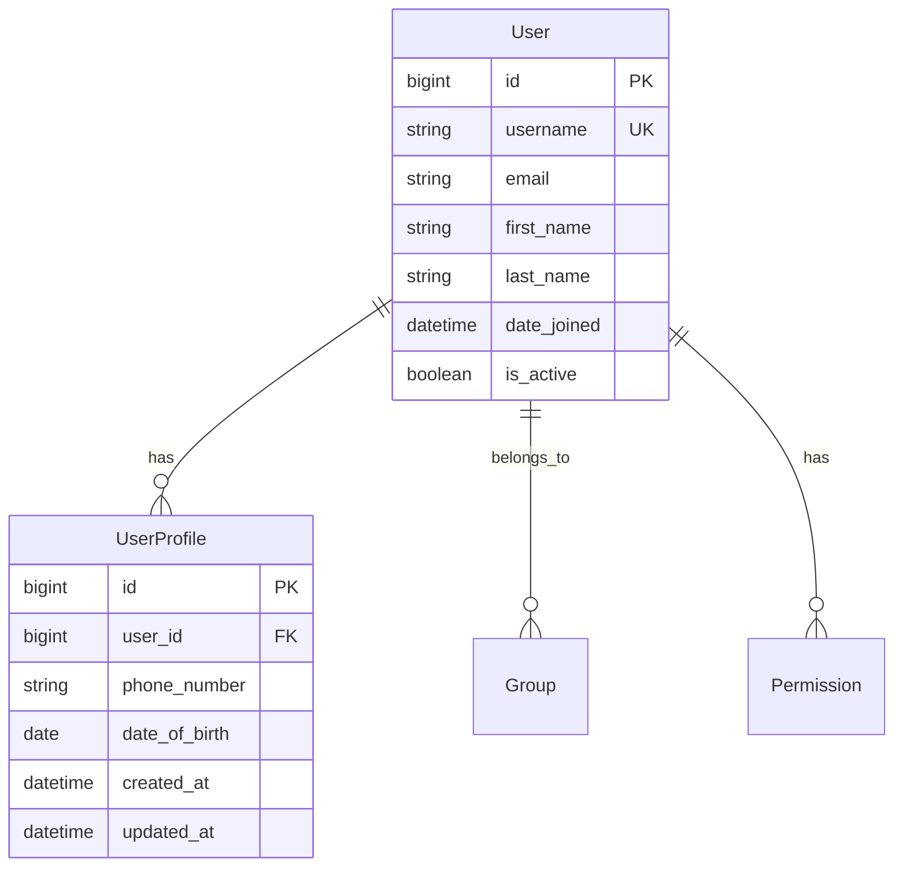

# BIDR Database Schema Documentation

## 📊 Overview

This document provides comprehensive documentation for the BIDR (Backend Infrastructure Data Repository) database schema, including all models, fields, relationships, and constraints.

**Database Information:**
- **Database Engine**: PostgreSQL
- **Database Name**: `bidr_db`
- **Database User**: `bidruser`
- **Django Version**: 5.1.11
- **Schema Version**: 1.0.0
- **Last Updated**: July 26, 2025

---

## 🗄️ Database Architecture

### Database Configuration
```python
DATABASES = {
    'default': {
        'ENGINE': 'django.db.backends.postgresql',
        'NAME': 'bidr_db',
        'USER': 'bidruser',
        'HOST': 'postgres-service',
        'PORT': '5432',
    }
}
```

### Default Primary Key Field
```python
DEFAULT_AUTO_FIELD = 'django.db.models.BigAutoField'
```

---

## 📋 Core Django Models

### Django Authentication System

#### User Model (`auth_user`)
Django's built-in User model for authentication and authorization.

| Field | Type | Constraints | Description |
|-------|------|-------------|-------------|
| `id` | BigAutoField | PRIMARY KEY | Unique user identifier |
| `username` | CharField(150) | UNIQUE, NOT NULL | Username for login |
| `first_name` | CharField(150) | NULLABLE | User's first name |
| `last_name` | CharField(150) | NULLABLE | User's last name |
| `email` | EmailField(254) | NULLABLE | User's email address |
| `password` | CharField(128) | NOT NULL | Hashed password |
| `is_staff` | BooleanField | DEFAULT FALSE | Admin access flag |
| `is_active` | BooleanField | DEFAULT TRUE | Account active status |
| `is_superuser` | BooleanField | DEFAULT FALSE | Superuser privileges |
| `date_joined` | DateTimeField | AUTO NOW ADD | Account creation timestamp |
| `last_login` | DateTimeField | NULLABLE | Last login timestamp |

**Relationships:**
- One-to-Many with `Group` (via `auth_user_groups`)
- One-to-Many with `Permission` (via `auth_user_user_permissions`)

**Indexes:**
- Primary key on `id`
- Unique index on `username`

---

## 📋 Additional Django Core Models

### Group Model (`auth_group`)
Django's built-in Group model for role-based permissions.

| Field | Type | Constraints | Description |
|-------|------|-------------|-------------|
| `id` | AutoField | PRIMARY KEY | Unique group identifier |
| `name` | CharField(150) | UNIQUE, NOT NULL | Group name |

**Relationships:**
- Many-to-Many with `User` (via `auth_user_groups`)
- Many-to-Many with `Permission` (via `auth_group_permissions`)

**Indexes:**
- Primary key on `id`
- Unique index on `name`

---

### Permission Model (`auth_permission`)
Django's built-in Permission model for granular access control.

| Field | Type | Constraints | Description |
|-------|------|-------------|-------------|
| `id` | AutoField | PRIMARY KEY | Unique permission identifier |
| `content_type_id` | IntegerField | FOREIGN KEY, NOT NULL | Reference to django_content_type |
| `codename` | CharField(100) | NOT NULL | Permission code name |
| `name` | CharField(255) | NOT NULL | Human-readable permission name |

**Relationships:**
- Many-to-One with `ContentType` (FOREIGN KEY)
- Many-to-Many with `User` (via `auth_user_user_permissions`)
- Many-to-Many with `Group` (via `auth_group_permissions`)

**Indexes:**
- Primary key on `id`
- Unique composite index on `content_type_id, codename`
- Foreign key index on `content_type_id`

---

### Content Type Model (`django_content_type`)
Django's built-in ContentType model for generic relations.

| Field | Type | Constraints | Description |
|-------|------|-------------|-------------|
| `id` | AutoField | PRIMARY KEY | Unique content type identifier |
| `app_label` | CharField(100) | NOT NULL | Django app label |
| `model` | CharField(100) | NOT NULL | Model name |

**Relationships:**
- One-to-Many with `Permission`
- One-to-Many with `LogEntry`

**Indexes:**
- Primary key on `id`
- Unique composite index on `app_label, model`

---

### Session Model (`django_session`)
Django's built-in Session model for user session management.

| Field | Type | Constraints | Description |
|-------|------|-------------|-------------|
| `session_key` | CharField(40) | PRIMARY KEY | Unique session identifier |
| `session_data` | TextField | NOT NULL | Serialized session data |
| `expire_date` | DateTimeField | NOT NULL | Session expiration timestamp |

**Relationships:**
- No direct foreign key relationships

**Indexes:**
- Primary key on `session_key`
- Index on `expire_date` for cleanup queries

---

### Admin Log Entry Model (`django_admin_log`)
Django's built-in LogEntry model for tracking admin actions.

| Field | Type | Constraints | Description |
|-------|------|-------------|-------------|
| `id` | AutoField | PRIMARY KEY | Unique log entry identifier |
| `action_time` | DateTimeField | NOT NULL | When the action occurred |
| `user_id` | IntegerField | FOREIGN KEY, NOT NULL | Reference to auth_user |
| `content_type_id` | IntegerField | FOREIGN KEY, NULLABLE | Reference to django_content_type |
| `object_id` | TextField | NULLABLE | ID of the modified object |
| `object_repr` | CharField(200) | NOT NULL | String representation of object |
| `action_flag` | SmallIntegerField | NOT NULL, CHECK ≥ 0 | Type of action (1=add, 2=change, 3=delete) |
| `change_message` | TextField | NOT NULL | Description of changes made |

**Relationships:**
- Many-to-One with `User` (FOREIGN KEY)
- Many-to-One with `ContentType` (FOREIGN KEY, nullable)

**Indexes:**
- Primary key on `id`
- Foreign key index on `user_id`
- Foreign key index on `content_type_id`

---

## 🔗 Junction Tables (Many-to-Many Relationships)

### User Groups Junction (`auth_user_groups`)
Junction table for User-Group many-to-many relationship.

| Field | Type | Constraints | Description |
|-------|------|-------------|-------------|
| `id` | AutoField | PRIMARY KEY | Unique junction record identifier |
| `user_id` | IntegerField | FOREIGN KEY, NOT NULL | Reference to auth_user |
| `group_id` | IntegerField | FOREIGN KEY, NOT NULL | Reference to auth_group |

**Constraints:**
- Unique composite constraint on `user_id, group_id`
- Foreign key constraint to `auth_user(id)` with DEFERRED checking
- Foreign key constraint to `auth_group(id)` with DEFERRED checking

**Indexes:**
- Primary key on `id`
- Unique composite index on `user_id, group_id`
- Index on `user_id`
- Index on `group_id`

---

### User Permissions Junction (`auth_user_user_permissions`)
Junction table for User-Permission many-to-many relationship.

| Field | Type | Constraints | Description |
|-------|------|-------------|-------------|
| `id` | AutoField | PRIMARY KEY | Unique junction record identifier |
| `user_id` | IntegerField | FOREIGN KEY, NOT NULL | Reference to auth_user |
| `permission_id` | IntegerField | FOREIGN KEY, NOT NULL | Reference to auth_permission |

**Constraints:**
- Unique composite constraint on `user_id, permission_id`
- Foreign key constraint to `auth_user(id)` with DEFERRED checking
- Foreign key constraint to `auth_permission(id)` with DEFERRED checking

**Indexes:**
- Primary key on `id`
- Unique composite index on `user_id, permission_id`
- Index on `user_id`
- Index on `permission_id`

---

### Group Permissions Junction (`auth_group_permissions`)
Junction table for Group-Permission many-to-many relationship.

| Field | Type | Constraints | Description |
|-------|------|-------------|-------------|
| `id` | AutoField | PRIMARY KEY | Unique junction record identifier |
| `group_id` | IntegerField | FOREIGN KEY, NOT NULL | Reference to auth_group |
| `permission_id` | IntegerField | FOREIGN KEY, NOT NULL | Reference to auth_permission |

**Constraints:**
- Unique composite constraint on `group_id, permission_id`
- Foreign key constraint to `auth_group(id)` with DEFERRED checking
- Foreign key constraint to `auth_permission(id)` with DEFERRED checking

**Indexes:**
- Primary key on `id`
- Unique composite index on `group_id, permission_id`
- Index on `group_id`
- Index on `permission_id`

---

## 🏗️ Custom Application Models

> **Note**: The BIDR project currently contains only Django's built-in models. Custom application models will be documented here as new Django apps are created and models are added to the project.

---

## 🔗 Relationship Documentation

### Model Relationships Overview



### Foreign Key Constraints

| Child Table | Parent Table | Foreign Key | On Delete | Description |
|-------------|--------------|-------------|-----------|-------------|
| `user_profiles` | `auth_user` | `user_id` | CASCADE | User profile deletion when user deleted |

---

## 🔍 Database Indexes

### Primary Indexes
- All models have automatic primary key indexes on `id` fields
- Django automatically creates indexes for `unique=True` fields

### Custom Indexes
```python
# Example of custom indexes that might be added
class Meta:
    indexes = [
        models.Index(fields=['created_at'], name='idx_created_at'),
        models.Index(fields=['user', 'created_at'], name='idx_user_created'),
    ]
```

### Performance Considerations
- Index fields frequently used in WHERE clauses
- Index foreign key fields for join performance
- Consider composite indexes for multi-field queries

---

## 🎯 Field Types Reference

### Common Django Field Types Used

| Django Field Type | PostgreSQL Type | Description | Example Usage |
|-------------------|-----------------|-------------|---------------|
| `BigAutoField` | `bigserial` | Auto-incrementing 64-bit integer | Primary keys |
| `CharField` | `varchar(n)` | Variable-length string | Names, titles |
| `TextField` | `text` | Unlimited text | Descriptions, content |
| `EmailField` | `varchar(254)` | Email address validation | User emails |
| `BooleanField` | `boolean` | True/False values | Flags, status |
| `DateTimeField` | `timestamp` | Date and time | Timestamps |
| `DateField` | `date` | Date only | Birth dates, deadlines |
| `IntegerField` | `integer` | 32-bit integer | Counts, IDs |
| `DecimalField` | `numeric` | Precise decimal numbers | Prices, measurements |
| `JSONField` | `jsonb` | JSON data | Configuration, metadata |

---

## 🔒 Database Constraints

### Field Constraints

#### NOT NULL Constraints
- All primary keys are implicitly NOT NULL
- Required fields have explicit NOT NULL constraints
- Optional fields allow NULL values

#### UNIQUE Constraints
- `auth_user.username` - ensures unique usernames
- `user_profiles.user_id` - one profile per user

#### CHECK Constraints
```sql
-- Example check constraints that might be added
ALTER TABLE user_profiles 
ADD CONSTRAINT check_phone_format 
CHECK (phone_number ~ '^\+?[1-9]\d{1,14}$');
```

### Foreign Key Constraints
- All foreign keys have referential integrity constraints
- CASCADE, SET NULL, or RESTRICT behaviors defined per relationship

---

## 🛠️ Database Operations

### Migration Commands

```bash
# Create new migrations
python manage.py makemigrations

# Apply migrations
python manage.py migrate

# Show migration status
python manage.py showmigrations

# Create specific app migrations
python manage.py makemigrations app_name

# Rollback migrations
python manage.py migrate app_name 0001
```

### Database Management

```bash
# Access PostgreSQL shell
kubectl exec -it deployment/postgres -n bidr -- psql -U bidruser -d bidr_db

# Create database backup
kubectl exec deployment/postgres -n bidr -- pg_dump -U bidruser bidr_db > backup.sql

# Restore from backup
kubectl exec -i deployment/postgres -n bidr -- psql -U bidruser -d bidr_db < backup.sql
```

---

## 📊 Database Monitoring

### Performance Metrics

#### Query Performance
```sql
-- Monitor slow queries
SELECT query, mean_time, calls, total_time 
FROM pg_stat_statements 
ORDER BY mean_time DESC LIMIT 10;
```

#### Table Statistics
```sql
-- Check table sizes
SELECT schemaname, tablename, 
       pg_size_pretty(pg_total_relation_size(schemaname||'.'||tablename)) as size
FROM pg_tables 
WHERE schemaname = 'public'
ORDER BY pg_total_relation_size(schemaname||'.'||tablename) DESC;
```

#### Index Usage
```sql
-- Monitor index usage
SELECT schemaname, tablename, indexname, idx_scan, idx_tup_read, idx_tup_fetch
FROM pg_stat_user_indexes
ORDER BY idx_scan DESC;
```

---

## 🔧 Schema Evolution

### Migration Strategy

1. **Development Migrations**
   - Create migrations for model changes
   - Test migrations on development data
   - Review migration SQL before applying

2. **Production Migrations**
   - Backup database before migrations
   - Apply migrations during maintenance windows
   - Monitor performance impact

3. **Data Migrations**
   - Use Django data migrations for complex changes
   - Test data integrity after migrations
   - Plan rollback strategies

### Version Control
- All migrations are version controlled
- Migration files are sequential and atomic
- Never modify existing migration files

---

## 📚 Best Practices

### Model Design
- Use descriptive field names
- Add appropriate constraints
- Document complex relationships
- Follow Django naming conventions

### Database Design
- Normalize data appropriately
- Use indexes strategically
- Plan for scalability
- Consider data retention policies

### Performance
- Monitor query performance
- Use database connection pooling
- Implement caching strategies
- Regular database maintenance

---

## 🧪 Testing Database Schema

### Model Testing
```python
# Example model tests
from django.test import TestCase
from django.contrib.auth.models import User

class UserProfileTestCase(TestCase):
    def setUp(self):
        self.user = User.objects.create_user(
            username='testuser',
            email='test@example.com'
        )
    
    def test_user_creation(self):
        self.assertTrue(isinstance(self.user, User))
        self.assertEqual(self.user.username, 'testuser')
```

### Migration Testing
```bash
# Test migrations in isolated environment
python manage.py test --keepdb
python manage.py migrate --fake-initial
```

---

## 📝 Documentation Maintenance

### Update Schedule
- Review schema documentation monthly
- Update after major model changes
- Validate relationships and constraints
- Update performance recommendations

### Change Log

| Version | Date | Changes | Author |
|---------|------|---------|--------|
| 1.0.0 | 2025-07-26 | Initial schema documentation template | System |

---

## 🚨 Emergency Procedures

### Database Recovery
1. **Connection Issues**
   - Check service status: `kubectl get pods -n bidr`
   - Verify credentials in secrets
   - Check network connectivity

2. **Data Loss**
   - Restore from latest backup
   - Apply incremental backups if available
   - Validate data integrity

3. **Performance Issues**
   - Check slow query logs
   - Monitor resource usage
   - Consider index optimization

### Contact Information
- **Database Administrator**: admin@bidr.com
- **Development Team**: dev-team@bidr.com
- **Emergency Contact**: on-call@bidr.com

---

*This documentation is automatically updated with each schema change. Last generated: July 26, 2025*
